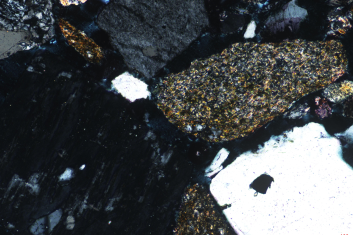
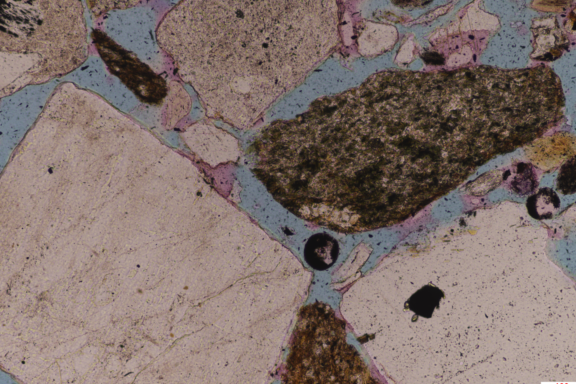
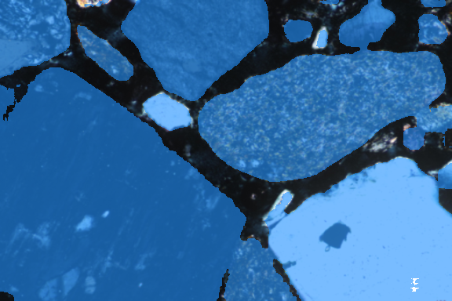

## Auto-SAM: Dual-Modal Auto-Prompting SAM for Rock Image Segmentation

Authors: Yijun Wang, Dongyu Zheng, Wei Zeng, Caihua Chen, Sixuan Wu, Hongjun Li, Yujie Gao, Chao Ma, Xiumian Hu, Mingcai Hou

## Weight Download

You can download the SAM weight at [here](https://dl.fbaipublicfiles.com/segment_anything/sam_vit_h_4b8939.pth)

Our model need to download two weight you can download [here](https://drive.google.com/drive/folders/1ZE-KgpZKiKM6Jjh2Wjz-ejjlYWWfVhob?usp=drive_link)

## Conda environment settings:

You can follow the [vrp-sam](https://github.com/syp2ysy/VRP-SAM) for environment 

## Training
Run train.py, you can modify the hyperparameter at train.py

## Visualize

Run visualize_demo.py

## Demo result

| XPL      | PPL      | result      |
|------------------------|------------------------|------------------------|
|  |  |  |

